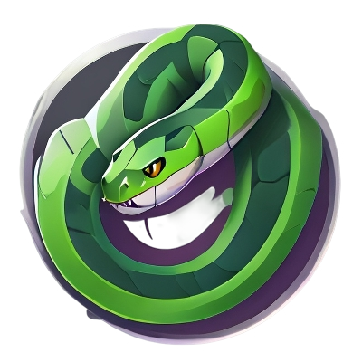
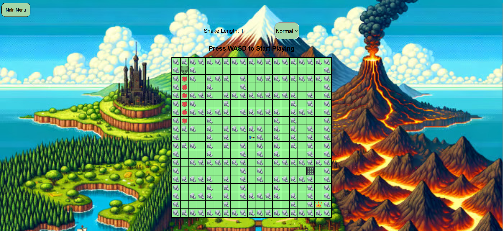
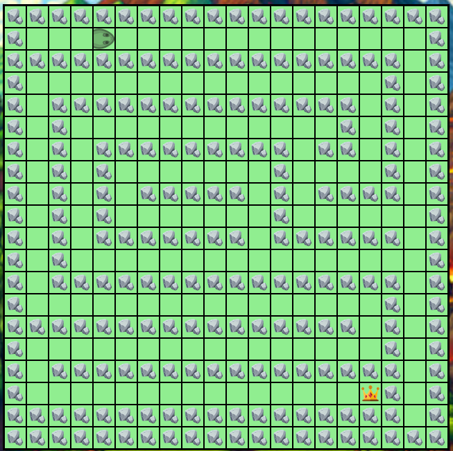
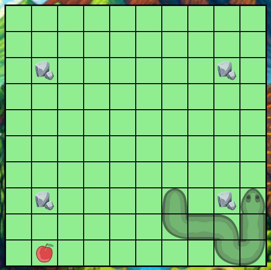

# Snake Game



This is a web-based implementation of the Snake game. Developed using HTML for structure, CSS for visual presentation, and JavaScript for game logic, it functions by allowing a player to control a snake that moves across a grid. The objective is to guide the snake to consume fruits, which causes the snake to grow longer. The game ends if the snake collides with its own body, rocks or the boundaries of the game area.

## Project Brief

the idea of the snake game is to eat fruits and grow longer till the player reaches a highscore or take the crown in order to go to the next level.
* Create a grid-based game suitable for desktop browsers.
* Design a way for players to win or lose the game and feed this back.
* Use HTML, CSS, and Vanilla JavaScript.
* The game should be playable for one player.
* the game should have enemies.
* Deploy the game online for the world to enjoy.


## Technologies

* HTML5
* CSS3
* JavaScript ES6
* Git

### Grid Design

I started with a grid of divs as this would allow me to accurately place the sprite and obstacles on the game board. I decided to use this method over using a canvas so that I could practice using 2D arrays.

I made a grid spawner that will spawn the cells of the grid based on the width an height variables, and in some scripts there is an array that allows me to visualize and spawn some objects like rocks, keys, doors, and the player.



## Game Mechanics

### Snake Movement
The snake moves based on the numbers on the grid, it will start by removing all the snake classes in the grid cells and then will place them in thier new position based on the snake movement history and length.



### Snake Sprite
This is achieved by making each picture of the snake divided into a state(Head,Body,Tail, etc...), and by making the pictures into backgrounds of classes, the grid will remove all the snake classes and then will place them in thier new position based on the snake movement and direction history these variables allowed me to rotate all the snake cells towards a direction that makes them look better visually. The rest of the snake follows and rotates the snake head based on the direction history except for the last snake cell, the last cell rotates towards the snake cell before it, this makes the snake tail look connected to the rest of the body at all times.



```js
    function placeSnake() 
    {
        removeSnake();
        for (let i = 0; i < snakeLength; i++) 
        {
            // last to first index
            const index = (snakeHistory.length - 1) - i;
            // this will delete the oldest number in the array if the array has more th
            if (snakeHistory.length > numberOfCells) 
            {
                snakeHistory.shift();
            }
            // index to cell position
            const snakePosIndex = snakeHistory[index];

            cells[snakePosIndex].classList.add("snake");
            
            // cell type
            if(i == 0)
            {
                cells[snakePosIndex].classList.add("snakeHead");
            }
            else if(i == snakeLength - 1)
            {
                cells[snakePosIndex].classList.add("snakeTail");
            }
            else
            {
                cells[snakePosIndex].classList.add("snakeBody");
            }
            
            // cell rotation
            if(snakeDirHistory[index] == (gridWidth * -1))
            {
                cells[snakePosIndex].style.transform = "rotate(0deg)";
            }
            else if(snakeDirHistory[index] == gridWidth)   
            {
                cells[snakePosIndex].style.transform = "rotate(180deg)";
            }
            else if(snakeDirHistory[index] == 1)
            {
                cells[snakePosIndex].style.transform = "rotate(90deg)";
            }
            else if(snakeDirHistory[index] == -1)
            {
                cells[snakePosIndex].style.transform = "rotate(270deg)";
            }

            // cell turning right
            if(snakeDirHistory[snakeDirHistory.length - i] !== snakeDirHistory[snakeDirHistory.length - i - 1])
            {
                if(i !== snakeLength - 1)
                {
                    // right turn
                    if(snakeDirHistory[snakeDirHistory.length - i] == 1 && snakeDirHistory[snakeDirHistory.length - i - 1] == (gridWidth * -1))
                    {
                        cells[snakePosIndex].classList.add("snakeTurnRight");
                    }
                    else if(snakeDirHistory[snakeDirHistory.length - i] == gridWidth && snakeDirHistory[snakeDirHistory.length - i - 1] == 1)
                    {
                        cells[snakePosIndex].classList.add("snakeTurnRight");
                    }
                    else if(snakeDirHistory[snakeDirHistory.length - i] == -1 && snakeDirHistory[snakeDirHistory.length - i - 1] == gridWidth)
                    {
                        cells[snakePosIndex].classList.add("snakeTurnRight");
                    }
                    else if(snakeDirHistory[snakeDirHistory.length - i] == (gridWidth * -1) && snakeDirHistory[snakeDirHistory.length - i - 1] == -1)
                    {
                        cells[snakePosIndex].classList.add("snakeTurnRight");
                    }


                    // left turn
                    if(snakeDirHistory[snakeDirHistory.length - i] == -1 && snakeDirHistory[snakeDirHistory.length - i - 1] == (gridWidth * -1))
                    {
                        cells[snakePosIndex].classList.add("snakeTurnLeft");
                    }
                    else if(snakeDirHistory[snakeDirHistory.length - i] == gridWidth && snakeDirHistory[snakeDirHistory.length - i - 1] == -1)
                    {
                        cells[snakePosIndex].classList.add("snakeTurnLeft");
                    }
                    else if(snakeDirHistory[snakeDirHistory.length - i] == 1 && snakeDirHistory[snakeDirHistory.length - i - 1] == gridWidth)
                    {
                        cells[snakePosIndex].classList.add("snakeTurnLeft");
                    }
                    else if(snakeDirHistory[snakeDirHistory.length - i] == (gridWidth * -1) && snakeDirHistory[snakeDirHistory.length - i - 1] == 1)
                    {
                        cells[snakePosIndex].classList.add("snakeTurnLeft");
                    }
                }
                else
                {
                    if(snakeDirHistory[index + 1] == (gridWidth * -1))
                    {
                        cells[snakePosIndex].style.transform = "rotate(0deg)";
                    }
                    else if(snakeDirHistory[index + 1] == gridWidth)   
                    {
                        cells[snakePosIndex].style.transform = "rotate(180deg)";
                    }
                    else if(snakeDirHistory[index + 1] == 1)
                    {
                        cells[snakePosIndex].style.transform = "rotate(90deg)";
                    }
                    else if(snakeDirHistory[index + 1] == -1)
                    {
                        cells[snakePosIndex].style.transform = "rotate(270deg)";
                    }
                }
            }
        }

        eatFruit();
        rotateSnake();
    }
```

### Detecting Collisions
This is a fairly simple process of checking whether the snake's next step has a class with the names of rock, hawk or door, this includes a boundary system that calculates the next step of the snake and checks if he is going outside the grid or if the snake is changing rows.

```js
    function checkBoundary() 
    {
        if (tempPos < 0 || tempPos >= numberOfCells) 
        {
            gameOver();
        }
        else if (tempPos % gridWidth == 0 && snakeDir == 1) 
        {
            gameOver();
        }
        else if ((tempPos % gridWidth) == (gridWidth - 1) && snakeDir == -1) 
        {
            gameOver();
        }
        else 
        {
            if (snakeHistory[snakeHistory.length - 1] != tempPos) 
            {
                snakeDirHistory.push(tempPos - snakePosition);
                snakePosition = tempPos;
                snakeHistory.push(snakePosition);
            }
        }
    }

```

## Getting Started

### Installation

1. Clone the repo\
```
git clone https://github.com/CodingSea/snake-game.git
```
3. Open snake-game folder
4. Run index.html

## Additional features

* More Levels
* More Enemies
* World-Wide Highscore

## Attributions
* snake sprites url: [snake](https://rembound.com/articles/creating-a-snake-game-tutorial-with-html5)
* door sprite url: [door](https://www.pngkey.com/detail/u2q8y3a9e6r5i1t4_lpc-doors-animated-1-2d-door-sprite/)
* Sound Effect by [Pixabay](https://pixabay.com/users/driken5482-45721595/?utm_source=link-attribution&utm_medium=referral&utm_campaign=music&utm_content=236677)

## In Conclusion

All in all, this was a fun project with plenty of creative scope, I'm pleased with the styling and think that I have the basis of a fun and playable game.
